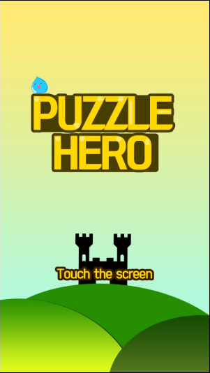
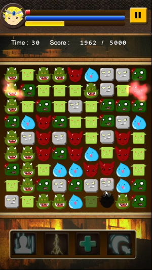
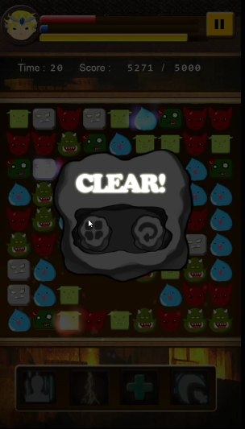
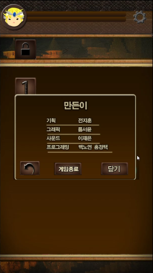

# PuzzleHero
|  |  |
| ----------------- | ----------------- |
|  |  |

#### 아주대학교 게임동아리 브레인스톰 1학년 팀프로젝트

프로젝트 소개 : 약해져라 용사여! 의 컨셉을 살려 만든 퍼즐게임입니다.

사용기술 : C++, Cocos2d-x

담당 역할 : 프로그래밍 (스킬 메뉴 씬 제외)

개발기간 : 2014년 7월~ 2014년 9월

핵심 기술 / 알고리즘 : 블록 교체 및 파괴

게임기획서 : https://github.com/justkoi/PuzzleHero/blob/main/%EA%B2%8C%EC%9E%84%EA%B8%B0%ED%9A%8D%EC%84%9C/%EA%B8%B0%ED%9A%8D%EC%84%9C_PuzzleHero.docx

플레이영상 : https://youtu.be/DUC70IuNres

프로젝트 주소 : https://github.com/justkoi/PuzzleHero

#### 핵심코드 설명